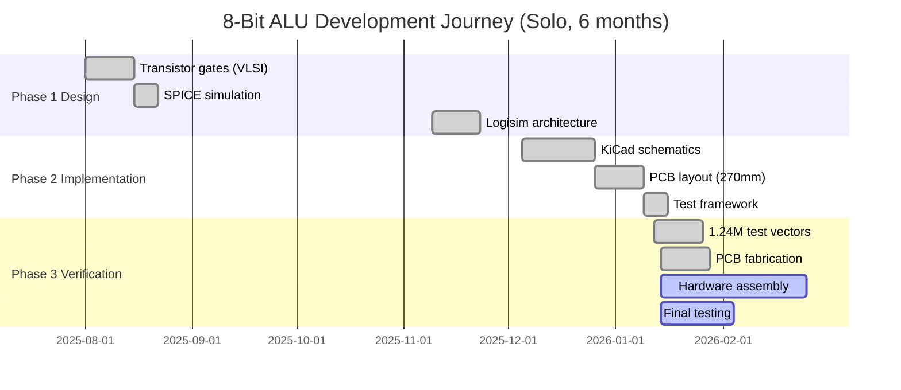

# Project Timeline

**Project Status:** Design & Simulation Complete | Hardware Ready for Assembly

**Key Milestones:**

- Aug 2025: All gates verified in SPICE
- Sep 2025: Complete system simulated in Logisim
- Oct 2025: **1,247,084 test vectors** passing (100%)
- Nov 2025: PCBs fabricated and received
- Dec 2025: Hardware assembly (Pending)
- Jan 2026: Final testing and documentation

### Visual Timeline

| Phase 1: MOSFET Design                                            | Phase 2: Schematic                                            | Phase 4: PCB Design                                            |
| ----------------------------------------------------------------- | ------------------------------------------------------------- | -------------------------------------------------------------- |
|  |  |  |
| *Aug 2025: Transistor layouts*                                  | *Sep 2025: Circuit design*                                  | *Oct 2025: PCB layout*                                       |

